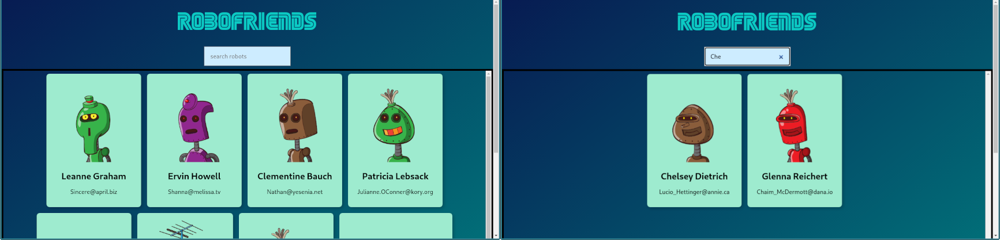

# Robofriends App
It's a tiny react project that comes with "The Complete Web Developer in 2020 Zero to Mastery" by Andrei Neagoie. It depicts react workflow, project structure, fetching api and state management with redux. The search functionality here is implemented with redux.

